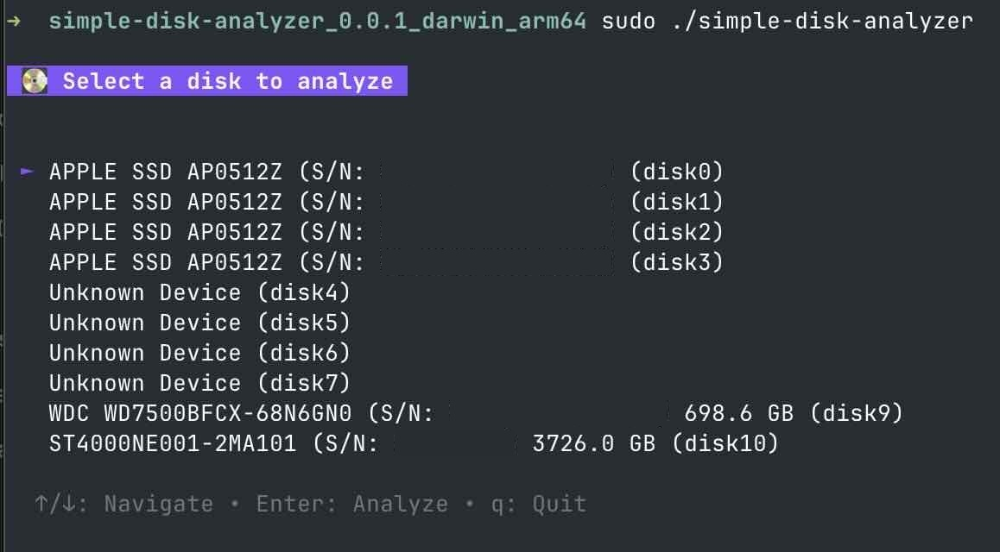
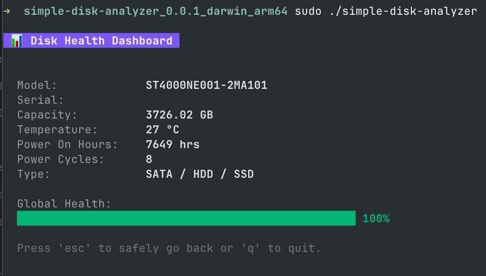
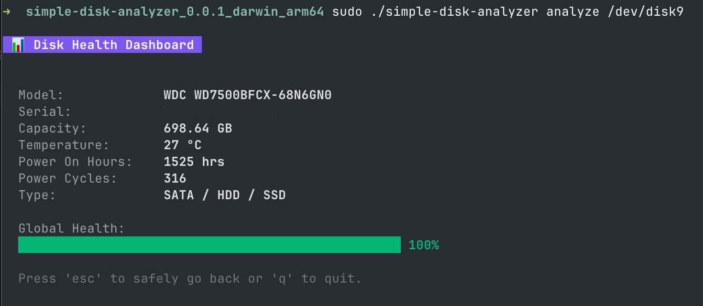

# Simple Disk Analyzer

Simple Disk Analyzer is a terminal-based tool (TUI) written in Go. It provides a minimalist, easy-to-read dashboard for monitoring the health of your storage drives (SATA HDDs, SSDs, and NVMe drives).

## How it works

The core of the application relies on `smartctl` (from the `smartmontools` package) to communicate with the hardware. When you launch the analyzer:
1. It scans your system for attached drives using `smartctl --scan` and by looking at your local devices.
2. It parses the raw JSON output provided by the drives, including S.M.A.R.T. attributes for SATA disks or the internal health log for NVMe drives.
3. It displays the relevant properties (Model, Serial Number, Capacity, Temperature, Power On Hours, and Power Cycles) in a visually appealing BubbleTea dashboard.

### Health Calculation

To keep the dashboard helpful for non-technical users, we calculate a "Global Health" percentage (from 0% to 100%).

- **For NVMe Drives**: We subtract the `PercentageUsed` attribute directly from 100%. We also heavily penalize the score if any `CriticalWarning` flag is raised by the controller.
- **For SATA Drives (HDD/SSD)**: We check critical S.M.A.R.T. attributes that indicate signs of physical degradation:
  - Reallocated Sector Count (ID 5)
  - Current Pending Sector Count (ID 197)
  - Offline Uncorrectable Sector Count (ID 198)

  By default, the health starts at 100%. For every raw error found in these critical IDs, the global health is reduced by 10%.

## Built With
- **[Go](https://go.dev/)**: Core language.
- **[Cobra](https://github.com/spf13/cobra)**: Handles the command-line interface and arguments.
- **[BubbleTea](https://github.com/charmbracelet/bubbletea)**: Drives the interactive terminal UI.
- **[Lipgloss](https://github.com/charmbracelet/lipgloss)**: Takes care of styling, colors, and the presentation of the UI.
- **[smartmontools](https://www.smartmontools.org/)**: External system dependency used to read raw disk data.

## Building Locally

To build the application locally, first ensure you have [Go](https://go.dev/) installed. Then, fetch the dependencies and compile the binary:

```bash
go mod tidy && go build -o simple-disk-analyzer
```

## Running the Application

To run the application, you can download the binary corresponding to your system from the releases. Because reading S.M.A.R.T. data directly from a disk requires high-level system permissions, you must execute it as an administrator:

### Using the Interactive Selection Menu

Start the application without arguments to launch the interactive disk selection menu. Here, you can navigate your connected disks and pick one to analyze:

```bash
sudo ./simple-disk-analyzer
```



Once you select a disk, it will load the health dashboard for that specific drive:



### Analyzing a specific disk directly

Alternatively, you can skip the selection menu and jump straight into the dashboard by providing the path to a specific disk:

```bash
sudo ./simple-disk-analyzer analyze /dev/disk1
```


